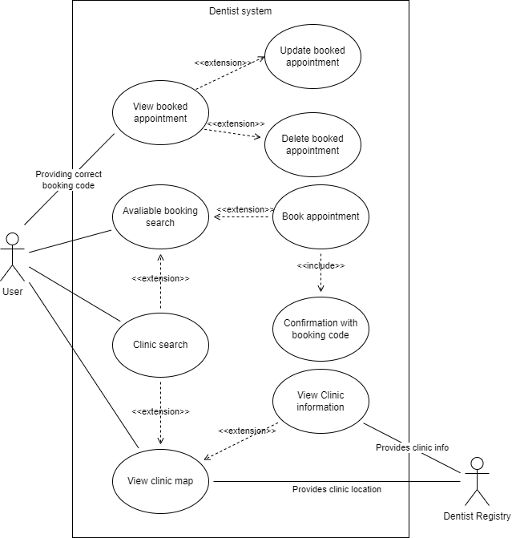

# Team-13 School Project

## Purpose
The purpose of this application is to create a webapp that handles booking dentist appointments and searching for clinics. These clinics will be visualized through an interactive map. Team of 6 members worked on this project, which was a part of DIT355 Mini Project: Distributed Systems Development in University of Gothenburg & Chalmers.

(Please note that this and other repos below are reuploads from my GitLab school account, for the sake of showing the source code. Potential problems may occur when trying to build and run the project)

## The relevant resources are as follows:
## Repositories:

### Client:
   * https://github.com/han-lue/DR-frontend
### Booking
   * https://github.com/han-lue/DR-booking
### Clinic Registry
   * https://github.com/han-lue/DR-clinic-registry
### RESTful API
   * https://github.com/han-lue/DR-rest-api
### Local-Infrastructure(Docker container containing local MQTT Broker & MongoDB for development purposes):
   * https://github.com/han-lue/DR-local-infrastructure

## Getting Started
### Step 1
First of all clone all the gitlab repositories.
- [Frontend](https://github.com/han-lue/DR-frontend)
- [Booking](https://github.com/han-lue/DR-booking)
- [Clinic Registry](https://github.com/han-lue/DR-clinic-registry)
- [Rest Api](https://github.com/han-lue/DR-rest-api)
- [Local Infrastructure](https://github.com/han-lue/DR-local-infrastructure)

### Step 2
Follow instructions to set up mqtt broker and mongoDB database via a docker component from the README.md file available in link below 
https://github.com/denesakin/DR-local-infrastructure

### Step 3
Open the local infrastructure repository in a terminal and run the below commands to set up the Mongo database and MQTT broker.
`cd [Your System Files]/local-infrastructure`
`docker compose up`

### Step 4
To set up all of the components, open a separate terminal for each of them and enter the following commands:
`npm install`

### Step 5
To run the backend open up the rest-api, booking and clinic-registry components in separate terminals enter below command.
`npm run dev`

### Step 6
Lastly to run and view the frontend open the frontend component in a terminal and do the following.
`npm run serve`

Now everything should work as intended! Hope you enjoy our dentist booking project 😃

### Common issues
The ports 3000, 3001, 3002 and 8080 are already in use. Hence, if other processes (or one or more components are already running) are using these ports an error will occur. The solution would be to end the processes using the port(s) or to modify the port(s) that the project is using.
unication be implemented so that the booking component can communicate with the client through RESTful api.

## Software Architecture Document (SAD):
### Publish & Subscribe
The publish and subscribe architecture style is used to enable components to communicate with each other in a manner that ensures distributed transparency. This architectural style allows us to design our system in an event driven manner (ie if a user makes a booking, we consider that to be an event). Furthermore, this also enables scalability, as adding more components would be able to communicate with the rest of the system by subscribing/publishing to topics, hence simplifying the integration process.

### Client & Server
The client and server architecture style is used within our components to communicate between our frontend web page and backend server. The communication between the components will be done by the broker and the client will use a RESTFUL API.

### Microservices
The microservices architecture style is used to ensure a decoupled system. This is done by having a collection of independent components with no shared memory communicating through messages. In addition, this assists in scalability since new components would not interfere with other components and functions independently.

### Pipe and Filter
The pipe and filter architecture was used in combination with the pub/sub architecture. We used this design decision to incorporate one-way processing in the system. An example of this would be the filtering happening in the booking component. An MQTT message contains two properties being method and data, data containing the request body and method being the indicator of what kind of HTTP method used. When handling a booking in the contorller we do not care about the method property in the MQTT message thus we filter it out right before the data from the request body gets handled by the logic in the controller.

## How is the conceptual design mapped onto implementation/technologies

### Publish & Subscribe
Ín our implementation, the publish and subscribe architecture style will be used between the client and the booking backend with the communication of MQTT. This style assists us in being able to continuously update the availability of the dentist bookings.

### Client & Server
In our implementation, we have a client, namely the frontend, which decouples from the server, namely the backend. These two components are separated and don’t rely on one another to function. We have implemented them so that they communicate with each other through a middleware, namely the RESTful API which then sends messages to an MQTT broker.

### Microservices
In our implementation, each component acts as a microservice, as they all provide their own unique service.

### Pipe and Filter
The pipeline and filter architecture maps to our implementation in terms of providing one way processing. In our case, the MQTT middleware would act as the pipe, and the different components would contain filters and testers that manipulate/check the incoming data. For example, if a Booking request is sent from the RESTapi to the Booking component, it would be sent via mqtt (pipe). This booking request would then go through transformer and tester filters in order to be processed by the booking component.

### Technologies
Deciding the design conception for the frontend client has let us understand the needs for the technologies that will be needed, vueJS, Axios, Google Maps Library API. Knowing what type of backend server we are going to work with lets us realize the requirements we need for the technologies used for the development. These technologies for the backend server are ExpressJS, NodeJS, and Mongoose for the mongoDB.

## Program Management Report (PMR):
For the project management practices, we are following scrum & kanban practices. We have biweekly sprints, that includes the following meetings: sprint planning, sprint review, and sprint retrospective. We also have a standup after half of a sprint has been completed to check up on “What you have done?”, “How is it going?”, “What do you plan to do?” “Is any assistance needed?”. For our requirements management, we use a kanban board on trello that is updated regularly to reflect the current state of the project/requirements.

## Diagrams

### Conceptual Diagram

### Use Case Diagram

### Component Diagram

### Detailed Clinic Registry System Component diagram

**Mapping of the "Detailed Clinic Registry System Component diagram" to the actual code:**

The main architecture style/pattern used here was the "pipeline and filter". This was chosen as one-way processing was required, and the data would mainly flow in a specific direction. In this case, we can see the data flow through a pipeline that starts from the external registry interface and ends at a mongoDB database. These components generally map directly to the code files. Ie, there is a JsonComparator.js file that compares the json data etc. The components would correspond to the following filters:

* **Producer:** Registry Reader - This component calls/retrieves clinic data from the external clinic registry. This component initiates the pipeline process.

* **Tester:** The JsonComparator retreives data from the external registry, and compares this to the existing database data. If there is a difference, the data will move into the next filter in the pipeline.

* **Transformer:** The DBUpdater component is considered a transformer in this case, as it converts the data (by using mongoose) to a suitable format so that it can be stored within the mongoDB database.

* **Consumer:** The mongoDB database would be the consumer in this case. This is because it would act as the termination point of the pipeline data flow.

## Component diagram change log:

### Clinic Registry System replaces Map System during sprint 2:

The reasoning for this is that we wanted to have a single component that the other components receive data from. We also wanted to ensure that any updates to the registry would also be made known to the system. Hence, this new "Clinic Registry System" component was added. We decided to instead remove the Map system, as the map was anyways contained inside of the client.

### Circuit Breaker related components are added during sprint 4:

The circuit breaker was added according to the project requirements. This addition can be seen in the "Booking system" component, where a "System Overload Handler" component was added (along with its nested components). The "RESTful API" component was also updated by adding a "Circuit Breaker status checker" component to the nested "Booking controller" component.

## Use case diagram change log:

### Unique booking codes replaces user accounts during sprint 2:

Our reasoning for this is that we wanted to simplify our process by not needing to have a component solely dealing with users i.e. registration and login. Instead, our workaround for this is to provide users with unique booking codes upon booking a dentist appointment. Using this booking code users could view, update and delete their bookings. In addition, we replaced the clinic registration with an available bookings search since it felt more appropriate with the number of clinics our system is going to handle.
